# Git book

## 1. Git in 10 minutes

## 2. Learning by doing

## 3. Git basics

## 4. Analysing data in a git repository

## 5. GitHub

## 6. GitLab

## 7. Azure DevOps, Bitbucket, Gitea and Gitolite

## 8. Workflows

## 9. Working techniques

## 10. Git in practice

## 11. Git problems and their solutions

## 12. Command reference

---

# 3. Git basics

## Internals

The **"git database"** is the ```.git``` folder that is generated when you write ```git init```. 


* **HEAD** is a text file that points to the current commit inside the current branch.
* The **branches** folder contains abbreviations for ```git fetch```, ```git pull``` and ```git push```. It's considered obsolete and will be deleted in the future.
* The **config** file is a configuration file for the repository.
* The **description** file represents a short description of the repository in text form.
* **hooks** is a folder containing scripts that have to run automatically in certain situations.
* **info/exclude** is a supplmenet similiar to a ```.gitignore```-file. It can be used in order to add files that will be ignored by git, just like in a ```.gitignore``` but without having to change the ```.gitignore``` file for all the other developers that are working in your project.
* The **index** ( not shown in the screenshot ) represents the staging area. This *file* is created whenever you use ```git add```. The binary file contains references to modified files, that were added to the staging area using ```git add```. ( stage = index = cache )
* In **logs** you can find all the reflogs.
* In the **objects** folder you will find hash codes for all the objects that were saved. These objects can be blobs, trees of changes, commits or tags.
* In the refs folder you can find references to commits/objects. The references points to the latest commits ( Heads ).

## Git objects

Git objects can be found in the ```./git/objects``` folder and can be of one of the following 4 types:

1. Commit: A commit object contains references to the tree of changes, the parent commit, the committer and the commit message, etc.. This data is called meta-data.
2. Blob: A blob ( binary large object ) contains a saved file. They are compressed binary objects that save a lot of space.
3. Tree: A tree object contains a list of file names with hashcodes, that point to certain blobs.
4. Tags: There are more types of tags. The easiest forms of tags are ```lightweight tags``` and these are text-files that are saved in ```/.git/objects/tags```.

## Git references

Git references ( refs ) are small files that reference a certain object ( a commit object ). For example you can find the the hashcode of the last commit object of the ```master``` branch inside ```refs/heads/master```.

You can use ```git show-ref``` to see all the references.

## Commits

A commit is a snapshot of the current state of the branch that you are currently on.

If you have a new file or you have deleted a commited file you will have to add the stages into the staging/cache/index area. All the changes that you make are in your current "workspace", that being the current branch that you are working on. In order to save those changes into the staging area you need to use ```git add/git stage```. In order to save these changes in to your repository, you have to **commit** them using ```git commit```. Here is a summary:

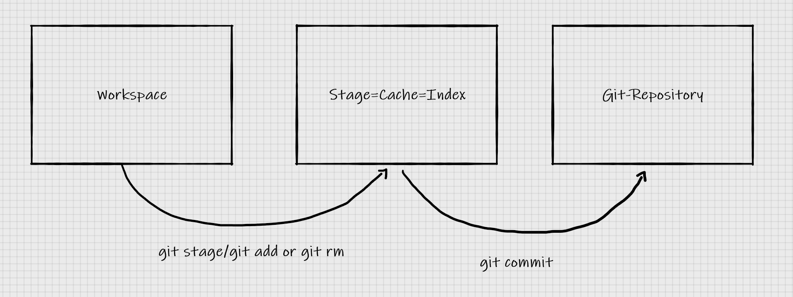

In the following, I will be talking about what happens internally with your files.

Let's say that you create a new repository and in this repository you add a file *foo.txt*. When you write ```git add foo.txt```, a new blob will be created for this file inside ```./git/objects```. This hash will look something like this: ```4619e73b2bd3f2f8bc7de3b5848cce2633d5f8d```. Inisde the objects folder, you will see a folder with the first two chars of the hashcode ( the sha code ), in this case *46*, and then the rest, so you will have ```./git/objects/46/19e73b2bd3f2f8bc7de3b5848cce2633d5f8d```.

In order to look at this blob, you can write ```git cat-file -p 4619``` ( you only need the first 4 chars ). If you want to see of what type it is, you can write ```git cat-file -t 4619```. *-p* stays for pretty print while *-t* stays for type.

If you create a commit for this file, you will get 2 more hashcodes. One hashcode will be for the tree object and the other hash code will be for the commit object.

* Commit objects contain meta data about the commit ( who ? when ?, etc ). It contains references to the last commit ( the parent commit ) of that branch and to the tree of changes.
* The tree object contains references to all the blobs in the active branch.
* For every staged/commited file there is a blob.

Git commands:

| Command | Description |
| ----------- | ----------- |
| ```git add``` | Adds a file to the staging area |
| ```git commit``` | Commits a file from the staging area to the repository |
| ```git cat-file -p <hash>```| Returns data about the given object ( blob, tree or commit ) |
| ```git cat-file -t <hash>```| Returns the type of object ( blob, tree or commit ) |
| ```git mv <oldfilename> <newfilename>```| Changes the name of the file |
| ```git mv <file> <into-another-directory>```| Changes the directory of a file |
| ```git rm```| Removes a file |

## Commit-Undo

### Reseting from staging area -> ```git reset```

If you have added a file to your staging area using ```git add/stage``` and you don't want that file to be in the staging area anymore so it won't be taken into consideration by the next commit you can use ```git reset <file>```. If you want to take all the files from the staging area use ```git reset``` ( with no parameters ).

### Restoring changes to last commit -> ```git restore```

If you have made changes to a file since the last commit and you don't want these changes anymore, you want to go back to the last commit, you can use ```git restore <file>``` and if you have made changes to multiple files and you want to undo these changes to all files that you've modified and go back to the last commit you can use ```git restore .```.

### Looking at files from older version -> ```git show```

If you want to see what a file looked like at a specific commit you can use ```git show <commit-hash/HEAD~n>:<file>```.
If you write ```git show HEAD:foo.txt```, it will show you how the file ```foo.txt``` looked like the last commit.
If you write ```git show HEAD~1:foo.txt```, it will show you how the file ```foo.txt``` looked like 2 commits ago.

Remember that you can see the **HEAD** number, the commit hash and commit message using ```git reflog```.

You can also look back at files from a specific commit. Example:

```git show ab3f:foo.txt```

This will show you how ```foo.txt``` looked like at that specific commit hash.

### Looking at changes from different version / Comparing different versions -> ```git diff```

You can use ```git diff``` to see the exact changes that have been made to a file.

```git diff <commmit-hash/HEAD~n> <file>```

### Restoring files from older versions -> ```git restore```

If you want to resoter files from older versions you can use ```git restore -s <commit-hash/HEAD~n> <file>```
The parameter ```-s``` stands for ```--source``` and it requires a tree of changes.

### Revoking commits -> ```git revert```

You can go back to older commits using ```git revert <commit-hash/HEAD~n>```. 
You can revoke more commits at once, but you will have to write a commit message for each of them which is a waste of time, so you can use the ```git revert -n``` which stands for ```git revert --no-commit```:

```git revert -n HEAD~2^..HEAD```

or 

```git revert -n abcd^..qwer```

It's important for the structure to look like this:

```git revert -n <commit-hash/HEAD~n>^..<commit-hash/HEAD~n>```

### Revoking commits -> ```git reset```

You can also revoke commits using ```git reset --hard/--soft <commit-hash/HEAD~n>```, but the difference is that the ```HEAD``` will point out to a different commit, you won't have to create a new commit. You will also see another history of changes when writing ```git log``` ( you can always write ```git reflog``` to see the changes that you've made and go back to commits that can't be seen by ```git log```).

The difference between ```--hard``` and ```--soft``` is that the changes that you've made won't be saved with ```--hard```, they will be overwritten by the commit that you're revoking.

### Temporarily changing to an older commit -> ```git checkout```

You can use ```git checkout``` in order to temporarily go to an older commit, you HEAD will be a ```detached HEAD```:

```git checkout <commit-hash/HEAD~n>```.

## Branches

Branches are widely used in teams in order to split the work in different tasks. You might one to work on a new feature for an app, but not push the code on the master branch directly because your work might not be finished yet or not tested. 
You can solve that problem by using branches.

In order to create a branch, you can use ```git branch <branch-name>``` and if you want to see a list of all branches ```git branch --list```.

You can also use ```git checkout``` in order to leave the current branch that you are on and go on another branch for a short time: ```git checkout <branch-name>```.

A branch is nothing else than a ```commit object```. The branches that you make will appear in ```.git/refs/heads```. This is why branching happens so fast and easy in git.

## Merge

If you've been working on a new feature on a special branch and you're done with that feature, you will want to integrate it into the main project, into the ```master``` branch. In order to do that you have to go back to the master branch and ```merge``` it using ```git merge branch_name```.

If you want to delete the branch directly after merging you can use:

```git merge -d branch_name```

If you want to see a list of your branches use:

```git branch --list```

You can also write ```--merged```/```-no-merged``` if you want to see if the branches were merged into the master branch or if people are still working on them.
You can also merge the ```master``` branch into your feature branch. You don't always have to merge the feature branch into your master branch, you can also do the opposite. If you've been working for a long time on your feature, you might want to stay up to date with what's happening on the real project ( on the ```master``` branch ); in order to do that you have to merge the ```master``` branch into your feature branch.

There are 2 types of merges:

* Fast-Forward Merge
* Normal Merge

### Fast-Forward Merge

Imagine you are working on the branch ```feature``` and you have made 2 commits on it: C and D. On the ```master``` branch, nothing has changed ( there haven't been any new commits ) since you've changed to the ```feature``` branch, so you only have commits A and B.

This is how your branches look like:

**master: A B**
**feature: A B C D**

If you want to merge the feature branch into the master branch, that is called a **Fast-Forward merge**.
A **Fast-Forward merge** is not a real merge since the only thing that is really happening is changing the *HEAD* pointer to the last commit of the merged branch.

### Normal Merge

A normal merge is when your master branch has at least 1 commit that the branch that you are trying to merge doesn't have:

**master: A B E**
**feature: A B C D**

In this case, you will have to write a special *merge commit message*.

### Octopus Merge

The octopus merge is when you merge multiple branches in one merge:

```git merge branch1 branch2 branch3``` 

**This is a very bad practice** since it's very hard to debug merge conflicts in this way, even if there are only 2 branches that are being merged together. The only advantage of this type of merge is that you only have to write one single commit message; however **it is a better practice to merge every single branch on its own**.

### Merging Strategies

There are multiple merging strategies that you can pick using

```git merge -s <strategy>```

* resolve
* recursive ( default )
* octopus
* subtree

From the git manual:

> resolve - This can only resolve two heads (i.e. the current branch and another branch you pulled from) using 3-way merge algorithm. It tries to carefully detect criss-cross merge ambiguities and is considered generally safe and fast.

> recursive - This can only resolve two heads using 3-way merge algorithm. When there are more than one common ancestors that can be used for 3-way merge, it creates a merged tree of the common ancestors and uses that as the reference tree for the 3-way merge. This has been reported to result in fewer merge conflicts without causing mis-merges by tests done on actual merge commits taken from Linux 2.6 kernel development history. Additionally this can detect and handle merges involving renames. This is the default merge strategy when pulling or merging one branch.

> octopus - This resolves more than two-head case, but refuses to do complex merge that needs manual resolution. It is primarily meant to be used for bundling topic branch heads together. This is the default merge strategy when pulling or merging more than one branches.

> ours - This resolves any number of heads, but the result of the merge is always the current branch head. It is meant to be used to supersede old development history of side branches.

> subtree - This is a modified recursive strategy. When merging trees A and B, if B corresponds to a subtree of A, B is first adjusted to match the tree structure of A, instead of reading the trees at the same level. This adjustment is also done to the common ancestor tree.

A short summary of them:

*Resolve* and *recursive* are almost the same but recursive results in fewer merge conflicts. We've already talked about the octopus merging strategy. If you are using ```git merge branch1 branch2 branch3``` you don't have to specify the *octopus* strategy since it's used automatically. The *ours* strategy is used when you want to pull in another head but throw away the changes that the head introduced. The *subtree* is used when you want to merge a project into a subdirectory of your current git project.

### Cherry Picking

You're working on ```branch1``` and already have a few commits ahead of ```master```. You go back to ```master``` in order to fix some bugs and make a few other commits on ```master``` as well and then go back to ```branch1```. You realize later that the bug that you've fixed on the ```master``` branch needs to be fixed on the ```branch1``` as well, so you could tehnically merge the ```master``` branch into your feature branch; however you realize that other commits have been made to the ```master``` branch that you don't want into your feature branch, meaning that you can't merge that branch. **In order to fix this problem you must cherry pick the commit where you've fixed the bug.

```git cherry-pick <commit-hash>```

Cherry picking means 'merging' one single commit. You are not merging the entire branch, you are just taking the changes that you've made on a specific commit.
The following image illustrates cherry picking:

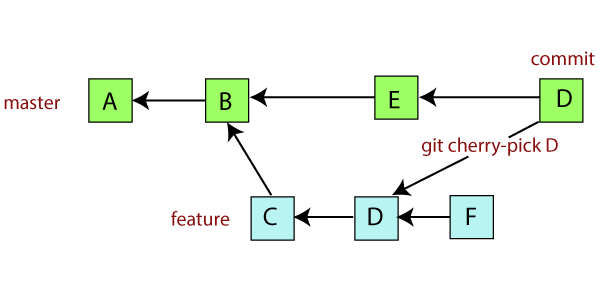

## Stash

Stashing is used when you want to save the changes that you've made, just like a commit, but not commit them.
If you are working for example on a feature and you have to switch to another branch in order to fix a bug, you might not want to commit the changes that you've made since they are probably not done yet and the feature isn't working properly yet.
In order to save the changes without making a commit you can use

```git stash```

After solving the bug on the other branch that you had to go to, if you want your changes back use

```git stash pop```

The stash works like a ```stack``` ( that's why you use *git stash pop* ). You can stash multiple changes. The first changes that you've stashed will be the last ones to get popped out of the stash

Using ```git stash list``` you get to see the stack of stashes that you have.
You can use ```git stash -p stash@{<n>}``` in order to get information about a certain stash.
Use ```git stash drop``` in order to delete one stash and ```git stash clear``` in order to delete all the stashes that you've made.

You can find references to all the stashes in *.git/refs/stash*.

## Remote Repository

### What are remote repositories

Git started as a decentralized organisation. But very soon, GitHub was created since not every developer could build a Git-Server for their team. 
A Remote Repository is just like a normal local repository with the only difference that it is stored on a git server ( like GitHub, GitLab, BitBucket, etc. ).

You can add a remote repository to your local repository ( so you can push to it later ) by using ```git remote add <name> <link>```.

Regardless of where your remote repository is stored, ```git push -u``` ( ```--set-upstream``` ) will just point to a link.

### Push And Pull

Let's take a look at the following example:
User A and User B are both working on the same project, on the same branch ( ```master``` ). They are both currently at the same commit.
User A makes 2 commits, pushes the changes onto the remote repository and leaves.
User B makes 3 commits but when he will try to push his changes, he will be rejected.

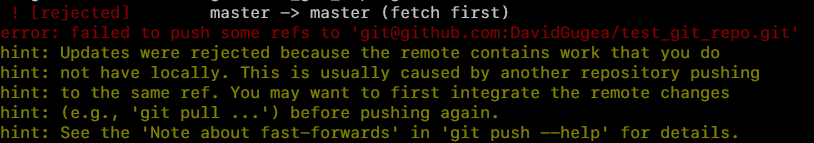

Before pushing into a remote repository, you must always make sure that you are on the latest commit of that remote repository, otherwise you will have to pull.

### Remote Branches

There is almost never the case that you will work directly on the master branch will all other developers on the team. Usually you create a branch for each feature and after finishing the feature and testing it, you will merge it inside the master branch.

In order to push a branch to a remote branch, you specify the name of the remote repository and then the name of the branch:

```git push --set-upstream <name> <branch_name>```

Concrete example:

```git push --set-upstream origin feature```

After doing this you will have that branch with its head and the name of the remote repository added to ```.git/config```:

```
[branch "feature"]
        remote = origin
        merge = refs/heads/feature
```

### Pull for all branches, push for the active branch

An important thing to know about ```git pull``` is that it downloads all the new commits on all branches, but it only performs a merge on the active branch.
If you are going to switch to another branch, you should use ```git pull``` one more time since the commits for that branch might have been downloaded but never merged.
```git pull``` is just a combination of ```git fetch``` and ```git merge```, so just because the commits have been downloaded using ```git fetch``` that doesn't always mean that they have been merged as well.

```git push``` however only takes in  consideration the active branch. If you have made commits on 3 different branches: ```master```, ```feature1``` and ```feature2``` but you used ```git push``` only on the ```master``` branch, only the commits on the ```master``` branch will be pushed onto the remote repository. If you want don't want to repeat ```git push``` on all the branches that you have new commits on, you can use ```git push --all```.

### Interna

Every branch that you push onto a remote repository and every branch that is downloaded when you pull a remote repository is called a **Tracking-Branch** ( more exactly a **Remote Tracking-Branch** ).
That means that git tracks this branches locally as well as remotely.
You can see all of your remote tracking branches in ```.git/refs```

```
> tree .git/refs

.git/refs
├── heads
│   ├── master
│   └── feature1
│   └── feature2
├── remotes
│   └── origin
│       ├── master
│       └── feature1
│       └── feature2
└── tags
```

You can use ```git branch --verbose``` to see all the local branches and their assigned remote branches.

Keep in mind that ```git status``` only shows you if you are up to date with the local files and it doesn't research the remote repository. If you want to make sure that you are not behind with your branch, use ```git fetch``` or ```git remote update``` ( both do the same thing ) and then use ```git status```.

### Multiple remote repositories

It is possible to use ```git remote add``` to add multiple repositories. You might want to do that if you want to use GitHub and GitLab for example simultaneously.

Example:

```
> git remote add gitlab git@gitlab.com:<account>/<repo>.git
> git push gitlab --all
```

If you add multiple repositories, they will all appear in ```.git/config``` with their url and fetch config ( including the local branches ).

```
# in .git/config
...

[remote "origin"]
        url = git@github.com:<account>/<repo>.git
        fetch = +refs/heads/*:refs/remotes/origin/*
[remote "gitlab"]
        url = git@gitlab.com:<account>/<repo>.git
        fetch = +refs/heads/*:refs/remotes/origin/*
[branch "master"]
        remote = origin
        merge = refs/heads/feature
[branch "feature1"]
        remote = origin
        merge = refs/heads/feature1
[branch "feature2"]
        remote = origin
        merge = refs/heads/feature2
```

## Solving merge conflicts

### Example of a merge commit and how to solve it

**In order to avoid merge conflicts it's better to merge more often since it's easier to solve a merge conflict if the load is smaller.**

Example of a merge conflict and how to solve it:

We have a file *foo.txt* on branch *feature1* that has *foo 1* written on the first line.
We have a file *foo.txt* on branch *feature2* that has *foo 2* written on the first line.

If we merge feature2 into feature1: ```git merge feature2``` ( while being on the  ```feature1``` branch) we will get a merge conflict since we have 2 different things on the same line.

This is how *foo.txt* will look like:

```
<<<<<<< HEAD
foo 1
=======
foo 2
>>>>>>> feature2
```

You will now have to choose one value ( it is also recommended to write a comment above the merge conflict specifying which value you choose and specifying the date of the merge conflict ).
You will then have to make a commit for the merge.

You can also use merge tools ( ```git mergetool --tool <tool>``` ) such as meld or vimmerge.

### Conflicts with binary files

If you get into a merge conflict with binary files ( a conflict with a PNG file for example ) you won't be able to manually change the code.
What you will have to do is specify directly which verision you want to keep:

Use ```git checkout --ours -- <file_name>``` if you want to keep your version of the binary file.
Use ```git checkout --theirs -- <file_name>``` if you want to keep the merged version of the file.

Keep in mind that if you stumble across a merge conflict with binary files the ```--ours``` and ```--theirs``` parameters while **rebasing** will be reversed since when you rebase, the merged files are treated as the base, they have the priority.

### Merge abort and undo

If you want to get out of the merge conflict use ```git merge --abort``` and if it's too late for that you can always use ```git reset --hard <hash>``` to go to the last commit.

### Whitespace Problems

If your code happens to be formatted slightly differently than the code merged by the branch, it can also come to a merge conflict related to whitespaces. In order to make a merge that disregards whitespaces use ```git merge -X ignore-all-space```.

### Internal Merge-Conflicts

There are cases where merge conflicts happen but git doesn't alert you of them because he's not aware. These types of merge conflicts won't alert you about any problems but your code will show bugs in the feature.
The best way to get ahold of internal merge-conflicts and make sure that if one such conflict happens you will be able to detect it as fast as possible, you must unit-test your code thoroughly.

### Merge Files

In case of a merge conflict, the following new files will be created:

* ```MERGE_HEAD``` contains the hash code of the branch that has to be merged. In the case of an octopus merge it contains all the hashcodes of all the branches envolved.
* ```MERGE_MODE``` is normally empty. If you, however, use ```git merge --no-ff``` ( which means that a merge commit will be needed regardless if it could have been a fast-forward merge or not ), the file will get some information.
* ```MERGE_MSG``` contains the text of the last commit and is not relevant for the merging process
* ```ORIG_HEAD``` contains the hash code of the current active branch.

After the merge is closed all the files will be deleted ( except for ```ORIG_HEAD``` ).

## Rebasing

Rebasing is just like merging but instead of building a merge commit, the history of the branch that you are rebasing on, is changed in such a way that it looks like the rebased merge was part of that branch.

**Rebasing on fast-forward merges is just like merging.**

Let's look at the following example:

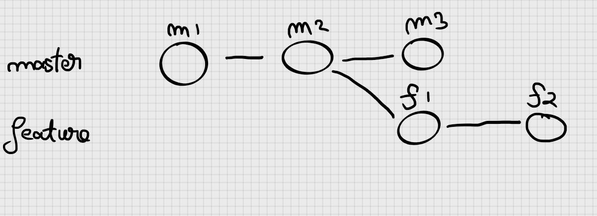

In this example we have our branch ```master``` with 3 commits and the feature branch with 2 commits:

```master  -> m1 m2 m3```
```feature -> m1 m2 f1 f2```

So the master branch is with at least one commit ahead of the feature branch.
If we go in the master branch and merge the feature branch right now, we will have to do a new merge commit.

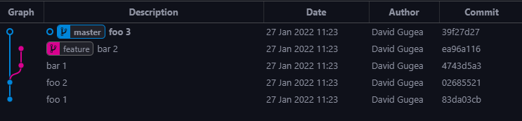

Now, if we merge the feature branch:

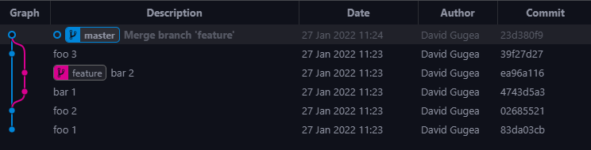

**The parent of ```foo 3``` hasn't changed after merging, it's still ```foo 2```**.
**In order to bind those branches, the new merge commit has 2 parents, ```foo 3``` and ```bar 2```, which are the Heads of the branches that we've merged together**.

Let's see how this looks like after rebasing the feature branch in the master branch:

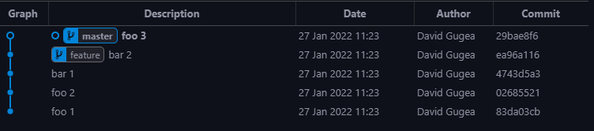

**In this case, the commit-hash of ```foo 3``` has changed.  That's because the parent of ```foo 3``` is not ```foo 2``` anymore. The parent of ```foo 3``` is now pointing towards ```bar 2```. This is what rebasing does**.

**After we've rebased, we have changed the history of our branch by changing the parent of the Head of the branch that we've rebased on**.

### The unwritten rule of rebasing

**AN UNWRITTEN RULE IS THAT YOU SHOULD *NEVER REBASE ON A PUBLIC BRANCH THAT WILL BE CONNECTED TO A REMOTE REPOSITORY*.** That is because you want to clearly see the changes that have been made to that specific branch.

### Pulling with rebase

You can also pull with rebase ( ```git pull --rebase``` ). This is also the most known reason for rebasing. This is used so often that you can even set it as default:

```git config [--global] pull.rebase true```

### Rebase conflicts

If you are in a rebase conflict with binary files remember that ```--ours``` and ```--theirs``` have 2 different meanings when using ```git checkout --ours/--theirs```. That means that ```--theirs``` is your version and ```--ours``` is the version of the branch that you want to rebase onto your branch.
And remember, the most important rule is that you should never use ```git rebase``` on branches that you will use ```git push``` on.

### Git rebase undo

With ```git rebase --into <newbase> <other>``` you can transfers the branch ```other``` to another base that is not your branch. Stackoverflow example ( https://stackoverflow.com/questions/21148512 ):

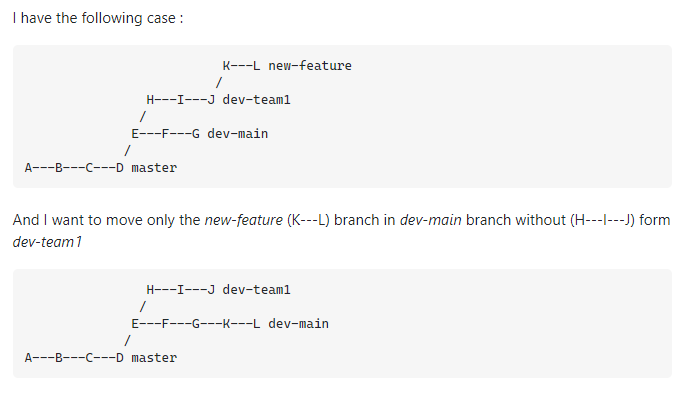
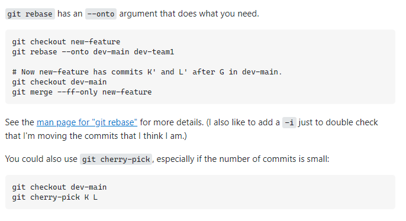

### Squashing

Squashing is made by using ```git merge --squash <other>```. By squashing, you get all the data ( new files, deleted files, modified files ) that you would get through a merge with the difference that you don't have to do a merge commit that contains 2 parents.
When you squash, you get all the data that you would get from a merge and that will be in your working directory. After you commit the new data, that commit will have nothing to do with the commits from the squashed branch and it will be treated as a normal, new commit, on your branch.

If I squash the ```feature``` branch in this example it would look something like this:


```git merge --squash feature```

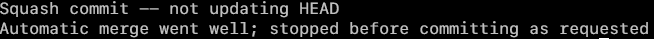

If I now check my working directory, I will get all the data that I would normally get from a normal merge, but without the commit:

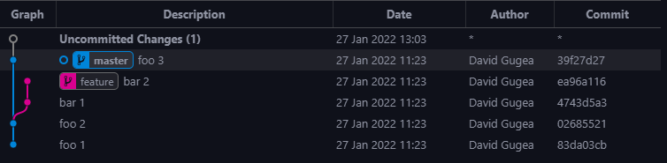
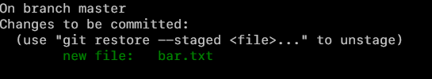

If I now make a new commit, that commit as I've said before, will be treated as a normal commit, not as a merge commit that has 2 parents:

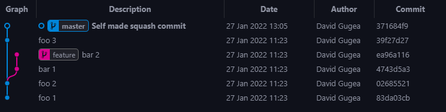

## Tags

### What is a tag and how to create one 

Up to this point references to commits where made by using hashcodes. Tags help you create "checkpoints" in your code at certain commits. A commit can have multiple tags. Tags are shown in the ```Releases``` section of a repository on **Github** ( this is platform-specific thing, not all tags have something to do with releases. The word 'releases' is not a thing in Git, only tags. )

You can create a tag at the commit you're at by using ```git tag <tagname>```.

### Types of tags

There are 2 types of tags:

* **Lightweight tags** - These tags are normal tags created with ```git tag  <tagname>```. These tags are saved in ```.git/refs/tags``` where the name of the file is the name of the tag and file contains the hashcode of the commit where the tag has been created.
* **Annotated tags** - These tags are created with ```git tag -a <tagname>``` and it also contains, besides the default information that comes into a tag, other information like for example when the tag was created. You can even give it a special message by adding the ```-m``` flag, just like you would do at a commit. It is also saved in ```.git/refs/tags``` but the tag file won't point at a commit, it will point at the tag object that would contain special information about the annotated tag and also a reference to the commit.

### Synchronizing tags

If you want to synchronize tags, it's important to know that by using ```git push```, your tags won't be pushed onto the remote repository. You can use the following options for push in order to properly synchronize tags:

* ```git push origin <tagname>``` will only push the given tag. This works for both lightweight and annotated tags
* ```git push --tags``` will push all the tags to the remote repository. This works for both lightweight and annotated tags. **This type of push will only push the tags, not the commits**. If you want to push both the tags and the commits at the same time you should push first, normally and then push all the tags.
* ```git push --follow-tags``` will push all the tags and the commits to the remote repository. **This option will only push annotated tags, lightweight tags will be ignored**.

You can use ```git config --global push.followTags true``` in order to make it as default to push annotated tags with each normal push.

### Settings tags to specific commits

If you want to set a tag for a specific commit use ```git tag <tag> <commit-hash>```.

### Deleting tags

If you want to delete a tag use ```git tag --delete <tagname>```.

### Correcting tags

If you made a mistake in yoru tag and you want to replace it and it hasn't been pushed yet then you can use ```git tag <new> <old>``` for lightweight tags and ```git tag <new> <old>^{}``` for annotated tags. It's a lot harder to correct tags after they've been pushed to a remote repository. When that happens, the other member must ```git pull --prune --tags``` since the tags won't be overriden when pulling.

### Signing tags

You can also sign tags with gpg keys.

## Commit references.

### What are revisions, what are referencs.

Revisions in git are files that are part of the git database and that can be packed inside a commit; so a commit can contain multiple revisions. A Revision can desscribe the status or version of a object in the git repository.

The easiest form of reference to a certain commit is the hashcode of that commit that you can get from ```git log``` ( ```git log --oneline``` is you are strictly only interested in the hashcode ).

### Going back to older commits

There are however other ways of going back to older commits:

* ```HEAD@{4}``` describes the commit that was made 4 **actions** ago, before the current commit. The ```{date}``` notation describes the reference-log ( ```git reflog``` ). That means that actions such as **pull**, **push**, **merge**, **rebase**, etc. are also included in the reflog.
* ```develop@{2 weeks ago}``` represents the last commit on the branch ```develop``` that was made at least 2 weeks ago. **This notation is using the reflog as well.**
* ```HEAD~2``` references the commit that sits 2 commits behind the vcurrent commit. **This notations is using the log, so you will only get to commit-objects.**
* ```@^2``` points to the second parent object of the current commit ( a merge commit has for example more than one parent ). ***```@``` is the abbreviated form for ```HEAD```**.

### Reference names

Reference names in git and names that are used in ```.git/refs``names `
u can use ```git show @``` or ```git show HEAD``` for example but you can also directly just use whatever is in ```.git/refs```: ```git show master``` or ```git show refs/heads/feature_xy``` or ```git show refs/remotes/origin/develop```.

### ```refname@{date}``` and ```refname@{n}```

With ```refname@{date}``` you can go back to older reference names based on a certain date. It will return the first object that matches that specific date. **```HEAD@{2 weeks ago}``` is for example the first commit that is older than 2 weeks.** If there is no such object in the ```reflog``` then you will get the oldest commit that there is.

With ```refname@{n}``` you will get the state of an object that was made ```n``` actions before ( remember that it uses the ```reflog```, so commands like ```git checkout``` or ```git reset``` etc. are also included ).

Both ```refname@{date}``` and ```refname@{n}``` work with git objects where the ```reflog``` is known. If you are cloning a repository, then that repository won't have a reflog, meaning that even if there are commits that should tehnically match your options, you will still get an error.

### Access to previous versions

With ```rev~n``` or ```rev^n``` you can get access to previous versions of objects.

Let's start with the ```~``` syntax:

* rev~ will give you the parent of the given version
* rev~1 is just like rev~
* rev~2 will give you the parent of the parent of an object

Now let's go to the ```^``` syntax:

* rev^ is just like rev~
* rev^1 is just like rev^
* rev^2 gives you the second parent element ( merge commits have for example more than one parent )

You can also use ```^``` multiple times:

* ```rev^``` = ```rev~```
* ```rev^^``` = ```rev~2```
* ```rev^^^``` = ```rev~3```

You can add ```:<file>``` after all the references that have been made in order to see a specific file in different versions of the commits.

## Git-Internals

### Object packages

In big repositories, you will get a lot of object in the ```.git/objects``` folder. This is very inefficient and will slow git down. This is why these objects are put in object packages. The object packages (```*.pack```) and their index files (```*.idx```) are all saved in ```.git/objects/pack```.

Git also has a garbage collector and you can call it manually ( ```git gc``` ). You don't have to call it manually since git does it for you automatically.

Whenever you are cloning a remote repository you will get a repository with all the objects packed inside ```.git/objects.pack```, you won't get the raw objects.

### The ```.git/index``` file

Files that are going in the staging/index area are saved in the ```.git/index``` file. This file contains the files in the staging area and their versions. The index-file is written in binary format.

### Git internal commands

* ```git cat-file <hashcode>``` will give you information about a certain object in the git database. You can use ```-p``` for pretty print and ```-t``` for time.
* ```git gc``` manually execute garbage collections
* ```git hash-object <file>``` will give you the hashcode of a file
* ```git ls-files``` will show you the files that are under version control
* ```git ls-tree``` will show you all the git tree objects 
* ```git pack-objects``` will manually build a package with git objects ( ```.git/objects/pack/*``` )
* ```git rev-list``` gives you a list just like ```git log``` that only contains the hashcodes.
* ```git rev-parse``` takes a reference of a git object ( for example ```HEAD~``` ) and returns its hash code
* ```git update-index``` puts files in the staging area.

# 4. Analysing data in a git repository

## Searching commits

### ```git log```

```git log``` displays the previous commits, starting from the current commit. This is possible because a reference to the parent commit is stored with each commit.

```git log``` shows you all the metadata of each commit ( date, author, branch, etc. ) including, and the commit message.

### Clear Logging

You can change the output of ```git log``` using the following options:

* ```--graph```: visualize the branches
* ```--oneline```: summarize each commit in one single line
* ```--all```: Shows the commits from other branches as well
* ```--decorate```: shows tags too
* ```--name-only```: lists the changed files too
* ```--name-status```: lists the type of change that was made for each file (```M``` for modified, ```D``` for deleted, ```A``` for added).
* ```--pretty=online|short|medium|full|fuller|...```: predefined output-formats for all metadata and commit messages
* ```--numstat```: lists the number of changed lines for each file
* ```--stat```: lists the amount of changes per file as a bar chart

### Custom formatting

You can change the formatting of ```git log``` by adding the optional ```--pretty=format'<fmt>'```. The formatting is similar to ```printf``` formatting.
You can also change the formatting of the date with ```--date=iso|local|short...```

Example:

```git log --pretty=format:'%h %<(20)%an %s'>```

|Code|Meaning|
|----|-------|
|```%H```|Commit hash|
|```%h```|Abbreviated commit hash (7-digits)|
|```%ad```|Author date|
|```%cd```|Commit date|
|```%an```|Author Name|
|```%ae```|Author Email|
|```%s```|Commit Subject|
|```%b```|Commit Body|
|```%n```|New line|
|```%<(20)```|Padding to the left ( with 20 in this case )|
|```%>(20)```|Padding to the right ( with 20 in this case )|
|```%Cred```|Color specification (i.e. red)|
|```%Cgreen```|Color specification (i.e. green)|
|```%C...```|Color specification|
|```%Creset```|Color reset|

### Searching Commit-Messages

With the option ```--grep 'pattern'``` ```git log``` will only show commits that have commit messages that cover the given ```'pattern'```. Upper and lowercase chars matter, if you don't want them to matter add ```-i``` to the option.

Example:

```git log --all -i --grep CVE```

### Searching for commits that change certain files

Soemtimes you might only be interested in commits that change certain files. In order to do this, you can give the name of the file to ```git log```:

```git log <file>```

If the name of the file is the same with the name of a tag, branch, etc. use the double-dashes:

```git log --<file>```

If the name of the file has been changed, use ```--follow```:

```git log --follow --<file>```

### Commits of a certain developer

With ```git log --author <name>``` or ```git log --author <email>``` you can search for commits that were written by a certain author:

```git log --oneline --author 'Linus Torvalds'```
```git log --oneline --author 'ibm.com'```

### Restricting the commit range (range syntax)

Normally, ```git log [<branch>]``` returns all commits of the current or specified branch back to the beginning of the commit sequence, which is usually to the first commit of the repository. This is not always useful. Often you are only interested in commits that are specific to a branch or branches, not the common base.

In such cases you can use the range syntax ```<branch1>..<branch2>``` or ```<branch1>...<branch2>```. Instead of branch names you can also use hash codes or other revision specifications.

```git log master..feature``` shows only the commits of the feature branch not merged with master.

Example:

```git
git log --oneline master..feature
git log --oneline feature --not master (the same)
git log --oneline feature ^master (also the same)

```

```git log master...feature``` with three dots works like the above command, but additionally takes into account the commits made since the branches were separated in master.

#### The range syntax with three points

The variant ```git diff <rev1>...<rev2>``` is particularly useful when the revisions are for branches. In this case, ```git diff``` first finds the last common base of both branches, and then displays what has changed in ```rev2``` compared to the last common commit. Unlike ```<rev1>..<rev2>```, however, all changes that have happened in ```<rev1>``` since then are ignored.

### Limiting Commits Chronologically

You can limit the commits received by ```git log``` with the following options:

* ```--since <date>``` or ```--after <date>```
* ```--until <date>``` or ```--before <date>```

### Sorting commits

By default, ```git log``` shows commits sorted after time, newest commit first. However, this changes when you add the ```--graph``` option. ```git log``` now bundles related commits. If you want to order the commits in time despite ```--graph```, use the ```--date-order``` option.

### Author date vs Commit date

Normally, the two dates are the same. This changes however when rebasing. The author date is given when the original commit was made and the commit date is pointing to the date when the rebasing was made.

### Marked commits (```git tag```)

With ```git log <tagname>``` you can get all the commits from a given tag.

Use ```git log- -simplify-by-decoration``` to get only commits that refere to a tag or a branch.

Normally, ```git log``` doesn't show the tags of commits, add the ```--decorate``` option in order to see the tag of each commit.

### Reference log (```git reflog```)

The reflog contains all locally executed commands that have changed the global HEAD or the head of a branch. The ```git reflog``` command lists these actions along with the hash codes of the commits.

If you want the detailed output of ```git log```, but at the same time want to see exactly the commits that ```git reflog``` returns, run ```git log``` with the ```--walk-reflog``` option.

## Searching files

### Showing old version of files (```git show```)

Use ```git show <revision>:<file>``` to see the old versions of a file. This gives the file ```<file>``` in the condition of the given ```<revision>``` commit.

### Differences between files (```git diff```)

If you want to see differences between files use ```git diff <revision>:<file>```.
This will show you the difference between the current version of the file and the version of the file that was in the ```<revision>``` version.

You can get a compact summary using ```git diff --compact-summary```.

You can also give two additional arguments to ```git diff```:

* With ```-G <pattern>``` you can give a search-pattern (regular expression). ```git diff``` will return only the files, that have the given search pattern in their modifications (cassing matters).
* ```--diff-filter=A|C|D|M|R``` filters the files that were *added*, *copied*, *deleted*, *modified* or *renamed*.

Example:

```git diff -G PDF --diff-filter=M --compact-summary v1.0..v2.0```

### Searching files (```git grep```)

Using ```git grep <pattern>``` you can search for certain files (casing matters). The command looks at all the files in the repository and only lists those that contain the given pattern.

You can get a more compact result with the ```--count``` option.

### Finding the authorship of code (```git blame```)

Use ```git blame<file>``` to search for the author of a certainp iece of code. If you don't give it any options, it will return the given file (line by line) and right on the left side who wrote every line and when.

You can add the followign options to it:

* ```--color-lines```: renders continuation lines from the same commit in blue color.
* ```--color-by-age```: indicates newly changed code in red (changes in the last month) and moderately new code in white (changes in the last year).

## Searching for mistakes (```git bisect```)

The idea of ```git bisect``` is that you first specify the last known good and bad commit. ```git bisect``` now performs a checkout in the middle of the commit area, thus halving the search area. (This is the case of a detached HEADS, i.e. HEAD does not refer to the end of a branch, but to some commit in the past)

Example:

```git
git bisect start
git bisect bad HEAD
git bisect good v1.5
```

In order to stop bisecting use ```git bisect reset```.

## Statistic and visualization

Use ```git shortlog``` to get a short log of the repository. It normally returns a list of alphabetically ordered commits of all authors:

```git
git shortlog --summary --numbered --email --no-merge --since 2020-01-01
```

You can get the total number of commits for all branches using ```git rev-list```:

```git
git rev-list --all --count
```

# 5. GitHub

-

# 6. GitLab

-

# 7. Azure DevOps, Bitbucket, Gitea and Gitolite

-

# 8. Workflows

## Feature branches for teams

The idea of this workflow is that each member builds a special so-called 'feature-branch' when implementing a feature and when the feature is done the member or members of the team make a pull-request to merge the feature branch on the master branch. The feature is reviewed by another or multiple other members of the team that have rights on the master branch and they will merge it if everything went well.
By using feature-branches you are also drasitcally reducing the dangers of merge-conflicts.

The key idea of this workflow is: ***new feature, new branch***

Advantages:

* undisturbed development of new features
* code reviews are made before merging the feature branch
* clear git history
* robust master branch

Disadvantages:

* dangers of code duplication
* complicated merges

## Long-Running Branches - Gitflow

When using the gitflow-workflow you must have at least 2 branches.
You have the master branch and (at least) one other branch called ```develop``` or ```next``` where the actual development of the app is happening.

The code on this branch should be robust and be available for Nightly Builds. You are only allowed to put finished Version of the app on the master branch. You don't make normal commits on the master branch.

The stability of the master branch is a priority of this workflow but it enhances the complexity of all other branches.

Advantages:

* robust master branch
* comprehensible versions of the app
* multiple versions in production

Disadvantages:

* a lot of merges
* high complexitz in the repositorz
* branches tend to drift apart
* slow rollout of new versions

## Trunk-based Development

When using trunk-based development the idea is to push all the changes made to the master branch as fast as possible.

The ground rules of this type of development are:

* no long-lasting branches outside of master
* when using feature-branches:
   * only one developer is allowed to work on a feature branch
   * you only have 1-2 days time (it's better if it only takes you a couple of hours)

In trunk-based development, the tasks have to be clearly defind and they have to be very small since a developer only has 1 to 2 days time to complete the tasks. Feature branches are optional in trunk based development since in the best-case scenario, all developers push directly to the master branch.

### Continuos Integration

A prerequisites for this type of development is a functional Continuous-Integration-Pipeline that secures the software through a large suit of tests. If there are any problems, the Pipeline Alarm will tell the developer that pushed the software what went wrong and the developer will have to fix the problems as fast as possible since nobody can push anything on the pipeline if the pipeline is broken.

In the ideal case, every developer should test the code locally before commiting.

### Release Ready

One big advantage of this type of development is that the main branch is always *release-ready*.

### Continuous Deployment

Trunk-based development is the ideal type of development for Continuous Deployment

### Feature-Flags

In the case when developming a feature takes more than 1 to 2 days, you must use so-called *feature-flags* or *feature-toggles*.

Queries are built into the code that decide whether certain functions are available or not. The conditions for this can be determined from a configuration file or from a database at runtime of the software.

### Advantages and Disadvantages

Advantages:

* the source code is always release-ready
* no complicated merges
* no code-freeze of releases

Disadvantages:

* hard start for inexperienced developers (compensable by pair-programming)